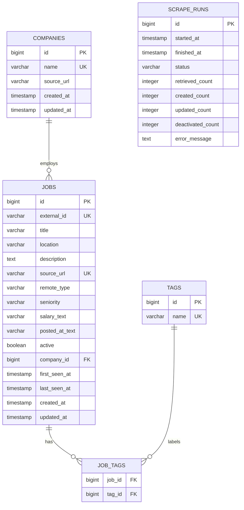
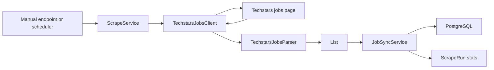
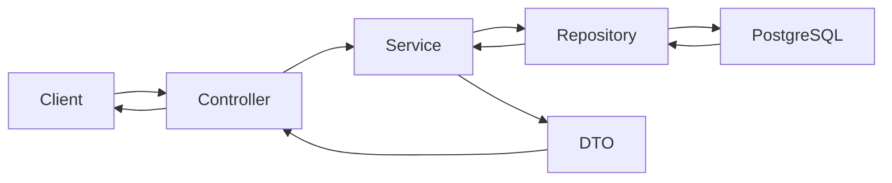

# Architecture

This document explains the structure and runtime design of the Techstars Job Parser application.

## Purpose

The application has two independent responsibilities:

1. Scrape job listings from `https://jobs.techstars.com/jobs` and persist them in PostgreSQL.
2. Serve already persisted data through a REST API with pagination and filters.

The API does not scrape Techstars during normal read requests. This keeps reads fast and isolates users from temporary scraper/network failures.

## Technology Stack

- Java 25
- Spring Boot 4
- Spring Web MVC
- Spring Data JPA
- Flyway
- PostgreSQL 18
- Docker Compose
- Jsoup
- Lombok
- Springdoc OpenAPI
- H2 for tests

## Package Layout

```text
io.ndmik.tsparser
├── config        # Application configuration objects
├── controller    # REST endpoints and exception mapping
├── dto           # API and internal transfer records
├── model         # JPA entities and enums
├── repository    # Spring Data repositories
└── service       # Business logic, scraping, synchronization, querying
```

## Main Runtime Components

### REST Layer

Controllers expose HTTP endpoints and delegate business logic to services:

- `JobController`
  - `GET /api/jobs`
  - `GET /api/jobs/{id}`
- `CompanyController`
  - `GET /api/companies`
- `TagController`
  - `GET /api/tags`
- `ScrapeRunController`
  - `POST /api/scrape-runs`
  - `GET /api/scrape-runs`
- `ApiExceptionHandler`
  - maps domain exceptions to HTTP error responses.

Controllers return DTOs, not JPA entities. This keeps the external API stable and avoids leaking persistence details.

### Service Layer

Services contain the main behavior:

- `TechstarsJobsClient`
  - Fetches the Techstars jobs page with Jsoup.
  - Applies timeout and User-Agent settings from configuration.

- `TechstarsJobsParser`
  - Converts the downloaded HTML document into `ScrapedJob` DTOs.
  - Normalizes text, tags, URLs, and stable job identifiers.

- `ScrapeService`
  - Orchestrates one scrape run.
  - Uses `AtomicBoolean` to prevent concurrent scrape execution.
  - Calls `TechstarsJobsClient` and then `JobSyncService`.

- `JobSyncService`
  - Converts scraped DTOs into persisted database state.
  - Creates new jobs.
  - Updates existing jobs.
  - Deactivates jobs missing from the latest non-empty scrape result.
  - Records scrape run statistics.

- `ScheduledScrapeRunner`
  - Runs scraper on a cron schedule when enabled.
  - Reuses `ScrapeService`, so the same concurrency guard applies.

- `JobQueryService`
  - Reads jobs with filters and pagination.
  - Maps `Job` entities into `JobResponse` DTOs.

- `ReferenceDataService`
  - Returns companies and tags sorted by name.

### Persistence Layer

Repositories are Spring Data JPA interfaces:

- `JobRepository`
  - CRUD for jobs.
  - `JpaSpecificationExecutor` for dynamic filters.
  - entity graph methods for loading company and tags with jobs.

- `CompanyRepository`
  - lookup by name and case-insensitive name.

- `TagRepository`
  - lookup by name and case-insensitive name.

- `ScrapeRunRepository`
  - CRUD and latest run lookup.

### Configuration Layer

- `TechstarsScraperProperties`
  - binds `techstars.scraper.*` settings from `application.yaml`.

- `OpenApiConfig`
  - defines Swagger/OpenAPI metadata.

- `TechstarsJobParserApplication`
  - Spring Boot entry point.
  - enables configuration properties scanning.
  - enables scheduling.

## Data Model



## Database Strategy

The application uses Flyway for schema management.

Migration file:

```text
src/main/resources/db/migration/V1__create_job_schema.sql
```

Hibernate schema generation is disabled:

```yaml
spring:
  jpa:
    hibernate:
      ddl-auto: none
```

This means Flyway is the source of truth for schema changes.

## Scraping Flow



Key behavior:

- Only one scrape can run at a time.
- Invalid scraped records are skipped.
- Duplicate scraped records are collapsed by `externalId`.
- Existing jobs are updated instead of duplicated.
- Jobs absent from a non-empty scrape result are marked inactive.

## API Read Flow



The public job API reads from PostgreSQL only. It does not call Techstars directly.

## Scheduling

Scheduling is enabled in Spring, but the scraper job is disabled by default:

```yaml
techstars:
  scraper:
    scheduling-enabled: false
    cron: "0 0 */6 * * *"
```

To enable scheduled scraping:

```yaml
techstars:
  scraper:
    scheduling-enabled: true
```

Default cron runs every 6 hours.

## Local Infrastructure

PostgreSQL runs via Docker Compose:

```yaml
services:
  postgres:
    image: postgres:18-alpine
    ports:
      - "5433:5432"
```

The app connects to:

```text
jdbc:postgresql://localhost:5433/techstars_jobs
```

The host port is `5433` to avoid conflicts with another local PostgreSQL running on `5432`.

## Error Handling

`ApiExceptionHandler` currently maps:

- missing jobs to `404 Not Found`;
- concurrent scrape attempts to `409 Conflict`.

Unexpected errors use Spring Boot defaults.

## Test Architecture

Tests use H2 in PostgreSQL compatibility mode:

```yaml
spring:
  datasource:
    url: jdbc:h2:mem:techstars_job_parser_test;MODE=PostgreSQL
```

The tests cover:

- parser behavior;
- synchronization behavior;
- jobs API;
- companies/tags API;
- scrape run API;
- scheduled runner behavior;
- OpenAPI endpoint.

